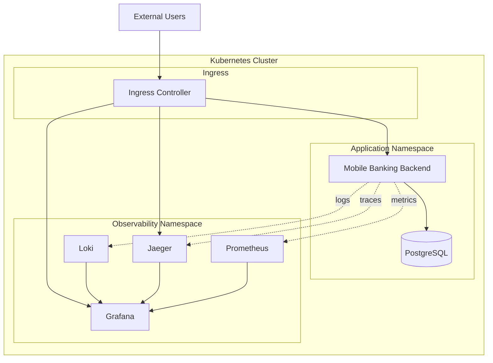

# Design Document

## Overview

This design outlines the deployment of the mobile banking backend application to Kubernetes with comprehensive observability capabilities. The solution includes containerization of the Spring Boot application, PostgreSQL database deployment, Prometheus metrics collection, Grafana visualization, distributed tracing with Jaeger, and centralized logging. The architecture follows cloud-native best practices with proper resource management, health checks, and security configurations.

## Architecture

### High-Level Architecture



### Component Architecture

1. **Application Layer**: Spring Boot backend with observability instrumentation
2. **Data Layer**: PostgreSQL with persistent storage
3. **Monitoring Layer**: Prometheus for metrics collection
4. **Visualization Layer**: Grafana for dashboards and alerting
5. **Tracing Layer**: Jaeger for distributed tracing
6. **Logging Layer**: Loki for centralized log aggregation

## Components and Interfaces

### 1. Application Container

**Purpose**: Containerized Spring Boot application with observability features

**Key Components**:

- Dockerfile with multi-stage build
- Spring Boot Actuator for health checks and metrics
- Micrometer for Prometheus metrics
- OpenTelemetry for distributed tracing
- Structured logging with correlation IDs

**Configuration**:

```yaml
# Application properties for Kubernetes
spring:
  profiles:
    active: kubernetes
  datasource:
    url: jdbc:postgresql://postgres-service:5432/mobilebanking
    username: ${DB_USERNAME}
    password: ${DB_PASSWORD}
management:
  endpoints:
    web:
      exposure:
        include: health,info,metrics,prometheus
  endpoint:
    health:
      show-details: always
  metrics:
    export:
      prometheus:
        enabled: true
```

### 2. Database Deployment

**Purpose**: PostgreSQL database with persistent storage and monitoring

**Key Components**:

- StatefulSet for PostgreSQL deployment
- PersistentVolumeClaim for data persistence
- ConfigMap for database initialization
- Secret for credentials management
- PostgreSQL Exporter for metrics

**Storage Configuration**:

- Storage Class: SSD-backed persistent volumes
- Size: 20Gi (configurable)
- Access Mode: ReadWriteOnce
- Backup strategy: Automated snapshots

### 3. Monitoring Stack

**Prometheus Configuration**:

- ServiceMonitor for automatic service discovery
- Custom metrics for business logic (transactions, registrations)
- JVM metrics collection
- Database metrics collection
- Alert rules for critical conditions

**Grafana Configuration**:

- Pre-configured dashboards for application metrics
- JVM performance dashboard
- Database performance dashboard
- Business metrics dashboard
- Alert notification channels

### 4. Tracing Infrastructure

**Jaeger Configuration**:

- All-in-one deployment for development
- Production-ready deployment with Elasticsearch backend
- Sampling configuration (10% default)
- Service mesh integration ready

**Application Tracing**:

- OpenTelemetry Java agent
- Automatic instrumentation for HTTP requests
- Database query tracing
- Custom spans for business operations

### 5. Logging Infrastructure

**Loki Configuration**:

- Promtail for log collection
- Log aggregation and indexing
- Retention policies (30 days default)
- Integration with Grafana for visualization

**Application Logging**:

- Structured JSON logging
- Correlation ID propagation
- Log level configuration via environment variables
- Security-sensitive data filtering

## Data Models

### Kubernetes Resources

**Deployment Specification**:

```yaml
apiVersion: apps/v1
kind: Deployment
metadata:
  name: mobile-banking-backend
spec:
  replicas: 3
  selector:
    matchLabels:
      app: mobile-banking-backend
  template:
    spec:
      containers:
        - name: backend
          image: mobile-banking-backend:latest
          ports:
            - containerPort: 8080
          resources:
            requests:
              memory: "512Mi"
              cpu: "250m"
            limits:
              memory: "1Gi"
              cpu: "500m"
          livenessProbe:
            httpGet:
              path: /api/actuator/health
              port: 8080
            initialDelaySeconds: 60
            periodSeconds: 30
          readinessProbe:
            httpGet:
              path: /api/actuator/health/readiness
              port: 8080
            initialDelaySeconds: 30
            periodSeconds: 10
```

**Service Configuration**:

```yaml
apiVersion: v1
kind: Service
metadata:
  name: mobile-banking-service
  labels:
    app: mobile-banking-backend
spec:
  selector:
    app: mobile-banking-backend
  ports:
    - port: 80
      targetPort: 8080
      name: http
    - port: 8080
      targetPort: 8080
      name: metrics
```

### Observability Configuration

**ServiceMonitor for Prometheus**:

```yaml
apiVersion: monitoring.coreos.com/v1
kind: ServiceMonitor
metadata:
  name: mobile-banking-monitor
spec:
  selector:
    matchLabels:
      app: mobile-banking-backend
  endpoints:
    - port: metrics
      path: /api/actuator/prometheus
      interval: 30s
```

**Grafana Dashboard ConfigMap**:

- Application performance metrics
- JVM heap and garbage collection
- Database connection pool metrics
- Custom business metrics (transaction volume, user registrations)
- Error rate and response time percentiles

## Error Handling

### Application Level

1. **Health Check Failures**:

   - Kubernetes will restart unhealthy pods
   - Readiness probe prevents traffic to unready pods
   - Graceful shutdown handling

2. **Database Connection Issues**:

   - Connection pool monitoring
   - Automatic retry mechanisms
   - Circuit breaker patterns

3. **Observability Failures**:
   - Metrics collection failures don't affect application
   - Tracing overhead monitoring
   - Log shipping resilience

### Infrastructure Level

1. **Pod Failures**:

   - Automatic pod restart by Kubernetes
   - Rolling updates for zero-downtime deployments
   - Resource limit enforcement

2. **Storage Failures**:

   - Persistent volume backup and recovery
   - Database replication for high availability
   - Monitoring of storage capacity

3. **Network Issues**:
   - Service mesh integration for resilience
   - Load balancing across healthy pods
   - Ingress controller failover

## Testing Strategy

### Unit Testing

1. **Application Tests**:

   - Existing Spring Boot test suite
   - Actuator endpoint testing
   - Metrics collection verification

2. **Configuration Tests**:
   - Kubernetes manifest validation
   - Helm chart testing
   - Configuration drift detection

### Integration Testing

1. **Database Integration**:

   - PostgreSQL connection testing
   - Migration script validation
   - Performance testing under load

2. **Observability Integration**:
   - Metrics endpoint accessibility
   - Trace propagation verification
   - Log aggregation testing

### End-to-End Testing

1. **Deployment Testing**:

   - Full stack deployment validation
   - Health check verification
   - Rolling update testing

2. **Observability Testing**:
   - Dashboard functionality
   - Alert rule validation
   - Trace visualization

### Performance Testing

1. **Load Testing**:

   - Application performance under load
   - Resource utilization monitoring
   - Auto-scaling behavior validation

2. **Observability Overhead**:
   - Metrics collection impact
   - Tracing performance overhead
   - Log shipping performance

## Security Considerations

### Secrets Management

1. **Database Credentials**:

   - Kubernetes Secrets for sensitive data
   - Secret rotation procedures
   - RBAC for secret access

2. **JWT Configuration**:
   - Secure key generation and storage
   - Key rotation strategy
   - Environment-specific configurations

### Network Security

1. **Pod-to-Pod Communication**:

   - Network policies for traffic control
   - Service mesh for mTLS
   - Ingress TLS termination

2. **External Access**:
   - Ingress controller security
   - Rate limiting and DDoS protection
   - Authentication for observability tools

### Container Security

1. **Image Security**:

   - Base image vulnerability scanning
   - Multi-stage builds for minimal attack surface
   - Non-root user execution

2. **Runtime Security**:
   - Pod security policies
   - Resource limits enforcement
   - Security context configuration

## Deployment Strategy

### Environment Progression

1. **Development Environment**:

   - Single replica deployments
   - In-memory databases for testing
   - Simplified observability stack

2. **Staging Environment**:

   - Production-like configuration
   - Full observability stack
   - Load testing capabilities

3. **Production Environment**:
   - High availability configuration
   - Comprehensive monitoring and alerting
   - Backup and disaster recovery

### Rolling Update Strategy

1. **Zero-Downtime Deployments**:

   - Rolling update configuration
   - Health check validation
   - Automatic rollback on failure

2. **Database Migrations**:
   - Flyway integration for schema changes
   - Backward compatibility requirements
   - Migration rollback procedures
